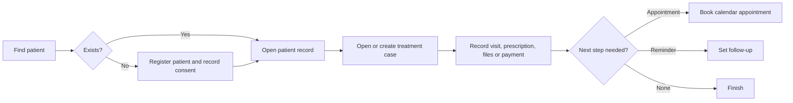

# Clinic Management System — Consolidated Requirements

## 1. Purpose and product boundary

Build a secure, easy-to-learn clinic management system for one practitioner and a small reception team. It must support the everyday path from patient registration to treatment, appointment, payment, and follow-up without making staff navigate a complex enterprise system.

This is a clinic-owned system, not a patient social network or a full hospital information system. It must keep clinical records, patient information, financial information, and uploaded files private.

## 2. Product principles

- **One clear path:** find or register a patient, open their case, record the action, then book the next appointment or follow-up.
- **Separate concepts:** a follow-up is a reminder; an appointment is a confirmed calendar booking. Booking an appointment from a follow-up clears that reminder.
- **Least access:** reception staff can schedule and register patients but cannot see clinical or financial details beyond what is required for safe scheduling.
- **No shared logins:** every staff member has a named account, so the system can identify who made an important change.
- **Safe, not cumbersome:** use plain forms, clear statuses, confirmation only for sensitive actions, and useful defaults.
- **Privacy by design:** collect only necessary data, show a clear privacy notice, and retain an audit trail for sensitive activity.

## 3. Users and access

| Activity | Admin / practitioner | Doctor (if added) | Receptionist |
|---|---|---|---|
| Register and find patients | Yes | Yes | Yes |
| View contact details and scheduling alerts | Yes | Yes | Yes |
| Manage appointments and reminders | Yes | Yes | Yes |
| View or edit clinical cases, notes, prescriptions and attachments | Yes | Yes | No |
| View or change treatment costs, payments and balances | Yes | Yes | No |
| View reports, analytics, exports, backups and audit log | Yes | Limited audit view | No |
| Manage staff, clinic settings and data-retention actions | Yes | No | No |

The practitioner may hold both the Admin and Doctor role in a one-doctor clinic. Permissions must be enforced by the server on every route, download, PDF, export, and API response—not merely hidden in the navigation.

## 4. Simple daily workflow

### Reception flow

1. Search by name or mobile number.
2. Register a new patient only when no matching patient is found.
3. Create, edit, cancel, or mark an appointment as completed/no-show.
4. See only scheduling-safe alerts, such as a visible medical-alert flag; do not expose clinical notes or money.
5. A no-show automatically creates a next-day follow-up on the patient’s latest active case for the clinician to review.

### Practitioner flow

1. Start on a dashboard showing today’s appointments, overdue follow-ups, upcoming follow-ups, active cases, and outstanding balance.
2. Open the patient, review alerts and active cases, then work in the relevant case.
3. Record clinical work and any payment in the same case.
4. Set a follow-up or book the next appointment before finishing.
5. Explicitly close a case only when treatment is complete; it must never close automatically.

## 5. MVP functional requirements

### 5.1 Authentication and account management

- The first administrator is created during secure setup. Administrators create and disable all subsequent staff accounts.
- Each account has a name, role, status, last login, and authentication method(s).
- Require a local password and time-based one-time-password (TOTP) second factor for administrators and clinicians. Provide one-time recovery codes and an administrator-controlled reset process.
- Rate-limit failed sign-in attempts, protect every state-changing request with CSRF protection, use secure session cookies over HTTPS, and invalidate sessions after password, role, or account-status changes.
- Require recent reauthentication before high-risk actions: user changes, backup/download/restore, bulk import/export, TOTP reset, and data erasure.
- Keep the login screen minimal: email/username, password, second factor when required, and an optional **Continue with Google** button (see Section 9).

### 5.2 Patient registration and patient record

- Search patients by name, mobile number, email, address, and (for authorised clinical users) clinical text.
- Store name, date of birth, calculated age, sex as approved by the clinic’s clinical/legal policy, mobile, email, address, emergency contact, guardian details for minors, medical conditions, allergies, and relevant alerts.
- Calculate age from date of birth; permit a documented manual age only for historic data where date of birth is unavailable.
- At registration, show the data-processing notice, require acknowledgement, record its timestamp, and collect communications consent separately with a default of off.
- Require guardian name, relation, and mobile number when the patient is a minor.
- Present the patient screen in this order: medical alerts, active cases, appointments, then contact/privacy details.
- Maintain a patient clinical-history timeline combining case events, visits, prescriptions, attachments, labs, and referrals.

### 5.3 Treatment cases and clinical records

- A patient may have multiple treatment cases. Each case has a title, active/closed status, practitioner, procedures, estimated/approved total cost, next-action note, follow-up date, and close timestamp.
- Case screen order: consent, visit notes, prescriptions, clinical attachments, lab requisitions, referral notes, payment log, follow-up/next action, and cost revision history.
- Store clinical notes and prescriptions as protected records; preserve author, timestamp, corrections/version history, and audit information.
- Show an allergy alert before recording or printing a prescription.
- Allow consent records and a consent PDF; prominently flag an active case with no recorded consent.
- Support a controlled correction/version process rather than silent destructive editing of clinical or financial data.

### 5.4 Files, labs and referrals

- Allow authenticated clinical users to upload X-rays, clinical photos, lab reports, and other approved file types.
- Store uploads outside the public web root using generated file names. Validate file size, extension, and file signature; serve files only through authorised routes.
- Record lab name, work description, sent date, expected return, received date, status (Sent, Received, Delayed), and notes.
- Record referral date, recipient, specialty, reason, and notes. Referral notes may be collapsed initially to keep the case page calm, with a printable referral letter.

### 5.5 Appointments and follow-ups

- Calendar appointments contain patient, optional case, practitioner, date, start/end time, title, notes, and status: Scheduled, Completed, Cancelled, or No-show.
- Prevent double-booking for the same practitioner. Show clear validation if a time overlaps.
- Provide copyable appointment-reminder text for staff to send by their approved communication channel; automated messaging is not required in the MVP.
- Allow staff to create an appointment directly from a case follow-up. On successful booking, clear that case’s follow-up date and next-action note.
- When an appointment is changed to No-show, create a next-day follow-up on the patient’s most recently updated active case. Do this once for the status change, not repeatedly.
- A dashboard follow-up is not an appointment and must never appear as a calendar booking until staff explicitly book it.

### 5.6 Payments and financial records

- Record payment date, amount, method, reference, and notes against the relevant case.
- Calculate balance live as approved case cost minus recorded payments; do not store a separate mutable balance.
- Preserve a cost-change history showing the old value, new value, reason, user, and timestamp.
- Restrict all financial fields, payment actions, financial PDFs, exports, reports, and backup downloads to authorised roles.

### 5.7 Dashboard, reports and exports

- Dashboard: overdue and due-soon follow-ups, today’s appointments, active cases, and total outstanding balance for authorised users.
- Show overdue follow-ups before due-soon follow-ups. Use status badges based only on the appointment status.
- Reports: date-range period totals, collected revenue, cases closed, new cases, new patients, pending payments, clinician-wise revenue, payments received, closed cases, and patient-retention status. Keep sections visible with a meaningful empty state.
- Analytics: optional charts and trends in a separate authorised area, not mixed into the operational reports page.
- Support authorised PDF printouts and an Excel export for permitted reporting and recovery needs. All exports must be logged.

### 5.8 Privacy, data rights and governance

- Provide a simple request register for Access, Correction, Erasure, and Withdrawal of Consent, including request date, due date, status, resolution, and audit events.
- Require an explicit confirmation of the patient identity/name before an erasure workflow starts.
- Use a policy-driven soft-anonymisation process where lawful retention of clinical or financial records is required. Do not hard-code a legal conclusion; have the clinic’s qualified legal adviser approve retention periods and erasure handling.
- Record security incidents/breaches, data-rights processing, consent changes, exports, and high-risk actions.
- Maintain a tamper-resistant, access-controlled audit log with actor, role, timestamp (UTC), action, target record, outcome, source information where appropriate, and redacted before/after summary. Do not copy entire clinical notes into the audit log.
- The system must meet applicable privacy and clinical-record obligations. The DPDP notice and process should be reviewed by qualified Indian legal counsel before production use.

### 5.9 Backups and recovery

- Keep encrypted daily local backups and encrypted off-site backups to one approved provider.
- Allow only administrators to create, download, restore, or configure backups.
- Retain backup status, failures, and test-restore results; alert the administrator when a backup fails.
- Restore only into a separate validation location first. A backup is accepted only after a successful clean-environment restore test.

## 6. Data model minimum

Core entities are Users, Patients, Cases, Case Events/Visit Notes, Prescriptions, Attachments, Lab Requisitions, Referrals, Appointments, Payments, Cost Revisions, Consent Records, Data-rights Requests, Audit Events, Settings, and Backups.

Every protected record should carry creation and update timestamps, the responsible user where applicable, and a stable identifier. Store UTC internally and display clinic-local time. Use additive database migrations; do not drop or silently rename existing columns in production.

## 7. Technical and security requirements

- Flask, SQLite, Jinja templates, and vanilla JavaScript are appropriate for this small single-clinic deployment; avoid a frontend build step and an ORM unless scale later justifies a change.
- Keep the database, uploads, branding, and backups in one configurable persistent data directory. Enable SQLite WAL mode, a busy timeout, short write transactions, and regular integrity checks.
- Encrypt data in transit with HTTPS. Use a strong environment-managed application secret and production-secure cookies.
- Enforce server-side role checks and record-level checks; unauthorised access returns `403` without revealing protected fields.
- Validate all input, use parameterised SQL, prevent path traversal, limit upload sizes, validate file contents, set security headers, and use a content-security policy.
- Generate PDFs in memory rather than leaving temporary medical documents on disk.
- Add automated tests for role boundaries, consent enforcement, no-show and follow-up behaviour, date-range boundaries, attachment authorisation, report/export authorisation, audit creation, and backup restoration.

## 8. Scope sequencing

### Release 1 — usable clinic core

1. Named users, roles, local password + TOTP, audit foundation, and clinic setup.
2. Patient registration, privacy notice/consent, search, and patient record.
3. Treatment cases, notes, prescriptions, consent, attachments, labs, referrals, and follow-ups.
4. Calendar appointments, conflict checks, no-show handling, dashboard, payments, and restricted reports.
5. Local/off-site backup, restore testing, exports, role-security tests, and production hardening.

### Release 2 — only after Release 1 is stable

- Structured dental charting (tooth/surface/finding/procedure/history; SVG only as the visual layer).
- Recurring appointments with bounded occurrences, exceptions, and per-occurrence changes.
- Patient portal, after a separate identity-verification design is approved.
- Retention sweeps, legal holds, breach workflow, advanced analytics, and richer branding.

## 9. Authentication decision: Google-linked sign-in

**Recommendation: do not make Google sign-in the only way to access this system.** Use named local accounts with TOTP as the required baseline, and offer Google sign-in as an optional convenience for approved staff accounts after the core system is stable.

Google OpenID Connect can reduce password friction and lets Google handle account sign-in, but it introduces reliance on staff maintaining Google accounts, internet availability, correct OAuth configuration, and an external identity provider. For a small clinic with sensitive health and financial data, a Google account must never automatically grant access merely because its email domain looks familiar.

If enabled, the Google option must:

- use OpenID Connect only for identity (`openid`, `email`, `profile`); do not request Gmail, Drive, Calendar, contacts, or other data scopes;
- link only to an existing, administrator-approved local user after verified email matching and an explicit first-time link step;
- preserve local password + TOTP and recovery codes as a break-glass path;
- allow the administrator to unlink Google, disable the account, revoke application sessions, and require reauthentication;
- validate issuer, audience/client ID, signature, expiry, nonce, state, and redirect URI server-side; never trust an email sent directly by the browser;
- log link, unlink, sign-in success/failure, and recovery events; and
- include Google as an identity processor in the privacy notice and vendor review.

This limited-scope approach avoids Google API verification complexity: Google states that sensitive scopes require review, while the sign-in scopes above are sufficient for authentication and do not need clinic access to a user’s Google content. Google recommends using its established OAuth/OIDC libraries and validates redirect URIs for web-server flows. See [Google OpenID Connect guidance](https://developers.google.com/identity/openid-connect/openid-connect), [Google OAuth web-server guidance](https://developers.google.com/identity/protocols/oauth2/web-server), and [Google’s scope guidance](https://developers.google.com/identity/protocols/oauth2/scopes).

## 10. Acceptance criteria

The system is ready for clinic use when:

- A receptionist cannot obtain clinical or financial information through pages, searches, URLs, PDFs, exports, browser responses, or backups.
- A clinician can register a patient, create a case, record a visit and prescription, save an attachment, take a payment, and set the next appointment/follow-up without leaving the patient journey.
- No-show and follow-up-to-appointment behaviour work exactly once and are covered by automated tests.
- Every sensitive change and every export/backup action has a usable audit event.
- Patient notice, consent, minors’ guardian details, and data-rights requests are recorded and testable.
- Authorised uploads are protected; unauthorised users cannot retrieve them.
- Backup restoration has been tested successfully in a clean environment.
- Google sign-in, if enabled, is optional, limited to identity scopes, linked to approved internal accounts, and cannot bypass local recovery or role controls.

## 11. Decisions intentionally deferred

- Exact clinical terminology/value sets, including the sex field, require clinician and legal/privacy review.
- Final DPDP retention, erasure, breach, and notice wording require qualified Indian legal review.
- Patient portal identity proofing must be designed before any patient self-service access is released.
- Choice of off-site backup provider, communication channel, and payment gateway (if any) remains a clinic operational decision.
